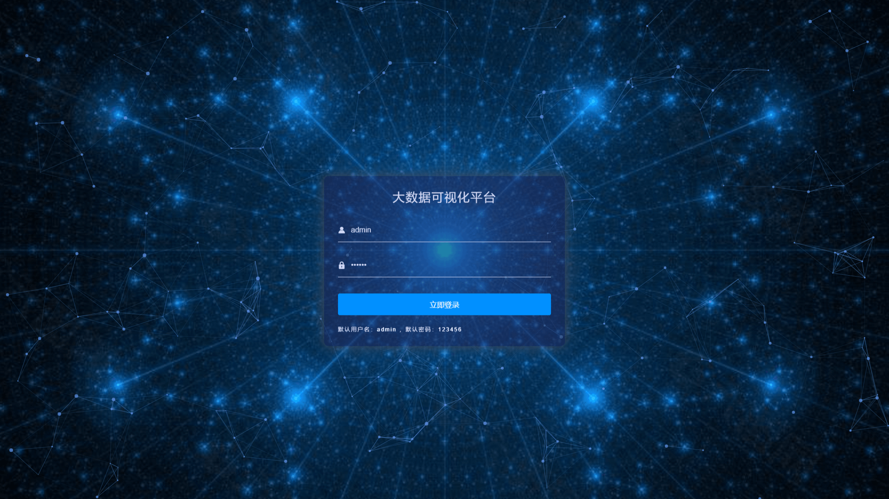
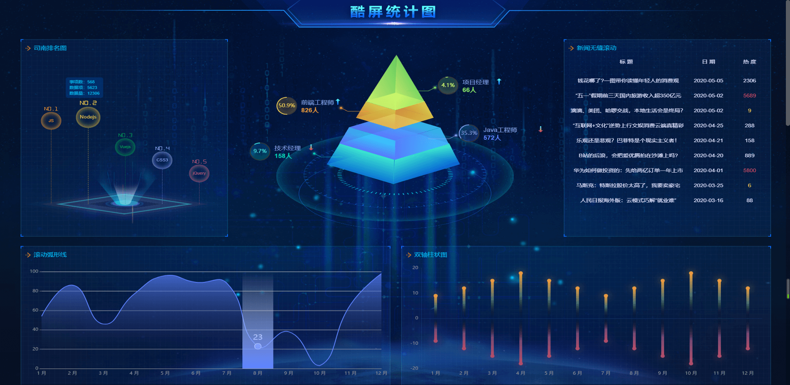
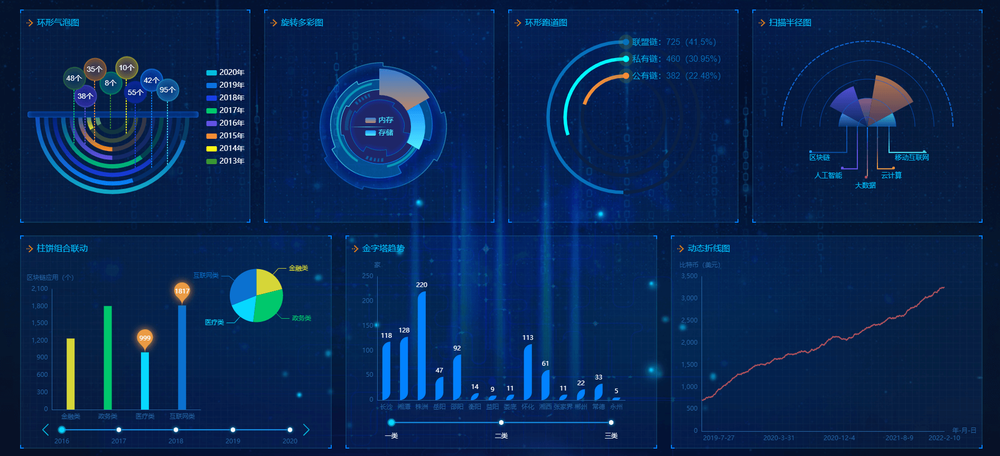
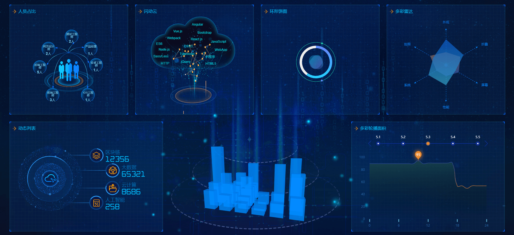
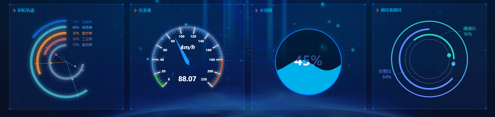
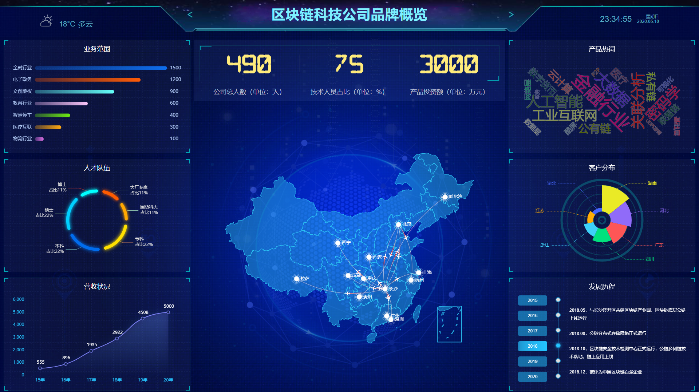

# 前言
<p align="center">
    
</p>

<p align="center">
	<a href="https://gitee.com/kleiBlue" target="_blank">
		
	</a>
	<a href="https://gitee.com/kleiBlue" target="_blank">
		
	</a>
	
</p>

<h1 align="center">《可视化大数据平台》· 开源，易上手~ </h1>

* 一个基于Vue前端框架和第三方图表库echarts构建的可视化大数据平台，通过vue项目构建、指令的灵活运用、组件封装、组件之间通信，使内部图表组件库可实现自由替换和组合。
* 项目中部分前端库采用外部CDN引入，可以减少打包文件体积，加快页面渲染。
* 可视化数据大屏展示对前端性能要求高，建议使用谷歌浏览器查看或开发，屏幕尺寸为1920px宽和1080px高是最佳效果。
* 目前制作数据可视化大屏，前端比较流行的第三方库有：Echarts（百度），AntV（阿里），Highcharts（国外公司），D3.js（国外公司）。
* 如果感觉还不错的话，老铁们是不是赏个★Star鼓励一哈，后续会持续更新和优化，也期待大家的交流。


[在线效果演示](https://jackchen0120.github.io/vueDataV/)

# 效果截图

## 登录界面




## 大数据可视化平台






## 公司品牌介绍




# 项目架构
```
│  vue.config.js                     // webpack配置              
├─public
│      favicon.ico                   // ico图标
│      index.html                    // 入口html文件
└─src
    │  App.vue                       // 根组件
    │  main.js                       // 程序入口文件
    ├─assets
    │  ├─iconfont                     // 引用阿里巴巴矢量图标库   
    │  ├─img                          // 存放公共图片文件夹      
    │  ├─js
    │  │      utils.js                // 封装工具类方法
    │  └─styles
    │      │  base.scss               // 基础样式文件
    │      │  common.scss             // 公用样式文件
    │      └─fonts                    // 字体库文件        
    ├─components
    │  │  index.js                    // 封装组件库
    │  ├─bar3d                        // 3D立体柱状图
    │  ├─bgAnimation                  // 登录界面背景图动画      
    │  ├─cakeLinkage                  // 柱饼组合联动    
    │  ├─circleNesting                // 圆环套圆环   
    │  ├─circleRunway                 // 环形跑道图   
    │  ├─colorfulArea                 // 多彩轮播面积     
    │  ├─colorfulRadar                // 多彩雷达 
    │  ├─companySummary
    │  │      business.vue            // 业务范围
    │  │      distrbution.vue         // 客户分布
    │  │      history.vue             // 发展历程
    │  │      income.vue              // 营业收入
    │  │      talent.vue              // 人才队伍
    │  │      wordCloud.vue           // 产品热词    
    │  ├─dynamicLine                  // 动态轮播折线图   
    │  ├─dynamicList                  // 动态列表动画   
    │  ├─flashCloud                   // 闪动云  
    │  ├─gauge                        // 仪表盘   
    │  ├─modal                        // 自定义全局模态框   
    │  ├─pyramid                      // 金字塔动画   
    │  ├─pyramidTrend                 // 金字塔趋势  
    │  ├─rainbow                      // 彩虹轨道图    
    │  ├─ringPie                      // 环形饼图    
    │  ├─ringPin                      // 环形气泡图   
    │  ├─rotateColorful               // 旋转多彩图   
    │  ├─scanRadius                   // 扫描半径图 
    │  ├─scrollArc                    // 滚动弧形线  
    │  ├─seamless                     // 新闻无缝滚动 
    │  ├─sinan                        // 司南排名图  
    │  ├─staffMix                     // 人员占比   
    │  ├─szBar                        // 双轴柱状图 
    │  ├─toast 
    │  │      index.js                // 注册全局消息提示框组件
    │  │      index.vue               // 自定义消息提示框模板
    │  └─waterPolo
    │          index.vue              // 水球图、水波图   
    ├─router
    │      index.js                   // 单页面路由注册组件
    ├─store
    │      index.js                   // 状态管理仓库未使用到
    └─views
            Brand.vue                 // 公司品牌介绍
            Home.vue                  // 酷屏首页统计图
            Login.vue                 // 登录界面
```


# 技术栈
 * vue2.6
 * echarts4.7
 * axios
 * webpack
 * ES6
 * scss
 * css3
 * jquery
 * iconfont
 
# 功能模块
* 登录界面抖动
* 粒子动效
* 背景图轮播
* 自定义全局模态框
* 自定义消息提示框
* 酷屏首页组件库
* 各种酷炫小部件
* 炫酷展示公司品牌

# 下载安装依赖
```
git clone https://gitee.com/kleiBlue/visual-big-data-platform.git
cd vueDataV
npm install 或 yarn
```

## 开发模式
```
npm run serve
```
运行之后，访问地址：http://localhost:8081

## 生产环境打包
```
npm run build
```
### 项目信息

1.  作者：王铭 (kleinBlue)
2.  邮箱：1511535206@qq.com
3.  QQ：1511535206


### 其他说明
> *  如果有不错的页面功能、设计，大家都可以参与项目开发
> *  关于后台：目前正在整理制作，之后会开源给大家，请关注项目
> *  作者 博客 [首页](https://blog.csdn.net/qq_43299703)（访问权限）


### 「前端铺子」交流群
加qq新群添加：472639422（加备注信息：Gitee）
<p>

</p>


### 赞助作者
> *  打赏就duck不必啦～ 就点点🌟 Star 🌟 关注更新，支持下作者就可以了

### 有项目、设计、其他方面需求合作，可以联系微信：

